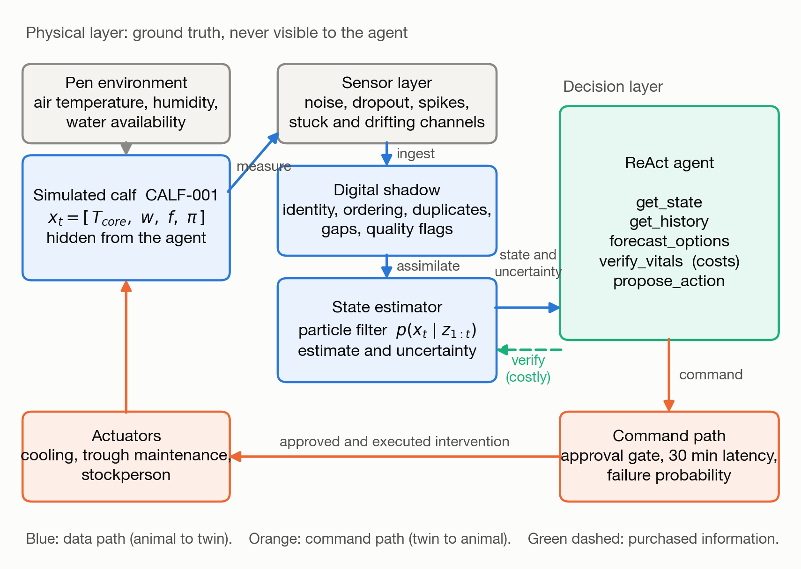
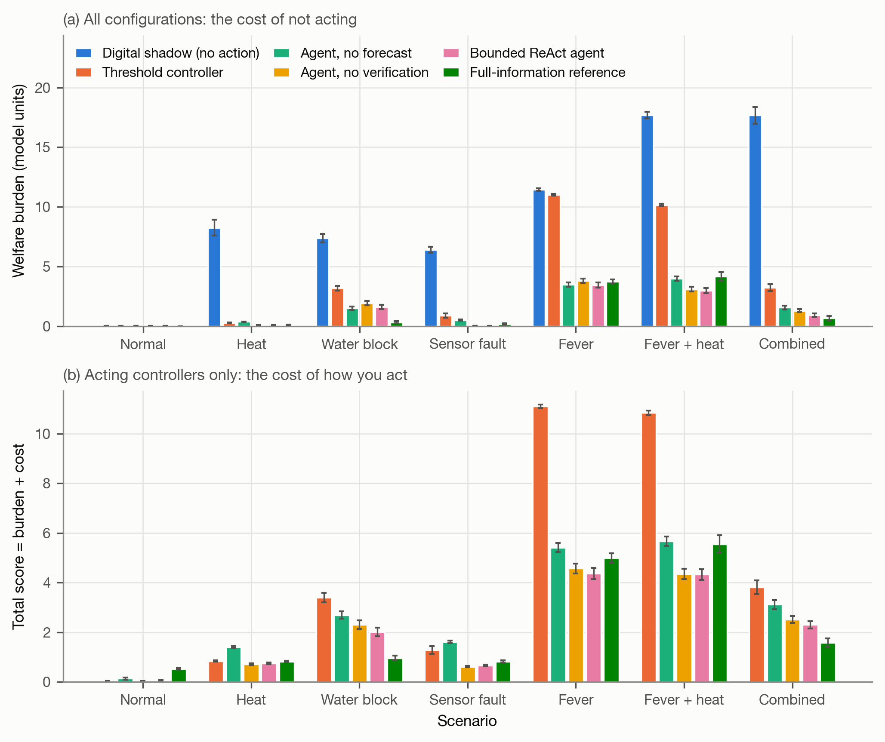
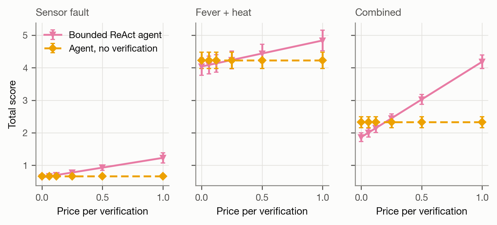

# CalfTwin-ReAct

A state-coupled agent testbed for dairy-calf digital twins.

CalfTwin-ReAct is a closed-loop simulation rig for asking a narrow question:
**when does an agent that reasons over an uncertain state estimate, buys
confirmatory measurements and closes the loop actually beat a digital shadow or a
fixed-threshold controller — and when does it just add cost?**

It is **not** a validated digital twin of a real calf. Every number here comes
from a simulator. The contribution is the rig and the comparison, not a claim
about any living animal. See [Validation status](#validation-status).

---

## What is actually modelled

Four layers are kept strictly separate so that a failure can be attributed to one
of them:

| Layer | Module | Role |
|---|---|---|
| Simulated calf | `calftwin/calf.py` | Ground-truth physiology. Hidden from the agent. |
| Sensors | `calftwin/sensors.py` | Noise, dropout, spikes, stuck and drifting channels. |
| Digital shadow | `calftwin/shadow.py` | Identity, ordering, duplicates, gaps, quality flags. No inference. |
| State estimator | `calftwin/estimator.py` | Particle filter over the latent state, with uncertainty. |
| Agent | `calftwin/agents/` | Reads the estimate, buys information, issues commands. |
| Command path | `calftwin/actuators.py` | Approval gate, 30 min latency, failure probability. |

The hidden state of the animal is

```
x_t = [ T_core , w , f , pi ]
```

core temperature (°C), body-water deficit (fraction of body mass), fatigue (0–1)
and pyrogen, an endogenous fever driver (0–1). A 42-day-old, 65 kg calf is
simulated in 15-minute steps, 96 steps per day.

### Why the problem is not trivial

1. **Core temperature is never measured.** The ear tag returns a skin
   temperature confounded by air temperature, so thermal state has to be inferred.
2. **A high temperature is diagnostically ambiguous.** On a hot day it is
   environmental load and cooling helps. In a cool pen it is fever — which raises
   the temperature the calf *actively defends*, so cooling does not resolve it and
   still costs money. Telling these apart is the agent's central judgement.
3. **Absent trough flow is ambiguous.** It means either a blocked trough or a
   calf that is not thirsty. The twin infers this from a water-balance residual
   rather than from its own belief about drinking.
4. **Faults look like physiology.** A stuck ear tag reads as a stable calf.

### The return leg

A digital shadow carries information from animal to model. What makes this a twin
is the path back, and a proposal is not an intervention:

```
proposal -> approval gate -> 30 min latency -> execution (may fail)
         -> pen changes -> animal state changes -> new measurement -> twin updates
```

Allowed actions are `observe`, `cooling_on`, `cooling_off`, `restore_water` and
`flag_human_check`. No treatment or dosing is implemented. `flag_human_check`
logs a request and starts a simulated clinical response; it contacts no one.



---

## Install and run

```bash
python -m venv .venv && source .venv/bin/activate     # Windows: .venv\Scripts\Activate.ps1
python -m pip install -e ".[dev]"
python -m pytest -q
```

One closed-loop day, with a figure and full artefacts:

```bash
python -m calftwin.cli demo --scenario combined --seed 7 --agent bounded_react
```

writes `trace.csv`, `metrics.json`, `commands.json`, `tool_calls.json` and
`day_trace.png` to `outputs/demo/`.

Compare controllers on one scenario:

```bash
python -m calftwin.cli compare --scenario fever_hot --seeds 20
python -m calftwin.cli scenarios
```

Reproduce every offline result:

```bash
python scripts/run_experiments.py --seeds 50        # ~5 min, no API key needed
python scripts/make_figures.py
```

---

## Scenarios

| Name | What happens |
|---|---|
| `normal` | Thermoneutral day, nothing wrong. |
| `heat` | Hot day with radiant load, air peaking near 33 °C. |
| `water_block` | Trough unavailable for about 9 h from mid-morning. |
| `sensor_fault` | Ear tag frozen for about 6 h plus a respiration dropout burst. |
| `fever` | Febrile episode in a thermoneutral pen. |
| `fever_hot` | Fever *and* heat load — hyperthermia is ambiguous. |
| `combined` | Heat, blocked trough, frozen ear tag and a drifting heart-rate channel. |

## Controllers

| Agent | What it is |
|---|---|
| `shadow_only` | Digital shadow: estimates, never acts. Lower reference. |
| `threshold` | Fixed alarm thresholds on raw values. The commercial incumbent. |
| `bounded_react` | Deterministic reason–act–observe loop with an explicit value-of-information rule. No language model. |
| `bounded_react_noverify` | Ablation: cannot buy confirmatory measurements. |
| `bounded_react_noforecast` | Ablation: cannot forecast candidate actions. |
| `full_info` | Same rule structure evaluated on the hidden state. A perfect-observation reference, **not** an optimal controller. Not deployable. |
| `llm_react` | A real language model driving the same tool surface. |

"ReAct-style" refers to interleaving reasoning with tool calls, after Yao et al.
(2023). `bounded_react` uses no language model; it is the reference the
language-model agent is measured against.

---

## The language-model agent

`calftwin/agents/llm_react.py` gives a model the same five tools and nothing
else. It cannot read hidden state, future weather, or the evaluation metric. Each
decision epoch is a bounded loop that must end in `propose_action`; epochs that do
not are counted as failures and default to `observe`.

```bash
export OPENAI_API_KEY=...            # or put OPEN_AI_KEY in .env
python -m calftwin.cli demo --scenario fever_hot --agent llm_react --model gpt-5-mini
python scripts/run_llm_experiments.py --pilot          # measure cost per epoch
python scripts/run_llm_experiments.py --budget 5.0     # full grid
```

Spend is capped by a process-wide budget guard that aborts the run rather than
overshooting. Token counts are recorded per episode and reported alongside the
effect on the animal, so the agent's cost is visible next to its benefit.

---

## Selected results

Over 2100 simulated days (7 scenarios x 6 configurations x 50 seeds), the bounded
agent reduces modelled welfare burden against the threshold controller on every
stressed scenario, most sharply where an elevated temperature is ambiguous between
heat load and fever. Buying confirmatory measurements is *not* uniformly useful:
it has a scenario-specific break-even price and only becomes decisive as sensor
noise rises. Full tables are in [`docs/RESULTS.md`](docs/RESULTS.md).





---

## Metrics

`burden` aggregates modelled strain of the simulated animal, computed from ground
truth and never visible to the agent:

- heat: degree-hours above 39.2 °C
- dehydration: (100 × deficit)-hours above 0.02
- fatigue: hours above 0.3

`total_score` adds intervention cost (cooling run-time, trough maintenance,
stockperson call-outs) and information cost (confirmatory measurements), so no
controller can win by spending without limit. **These weights are illustrative
model units — not money and not a validated welfare index.**

Estimation quality is reported separately: RMSE against hidden truth, bias, and
95 % interval coverage.

---

## Validation status

- All data are synthetic. No animal was measured.
- Parameters are physiologically plausible, not calibrated to a herd.
- The simulator's thermoregulation, water balance and fever response reproduce
  qualitative textbook behaviour (see `tests/test_calf.py`), which is a sanity
  check, not validation.
- Results are claims about *the architecture under this simulator*, not about
  calf welfare.
- The twin's water-deficit estimate systematically underestimates severe
  dehydration, because the deficit is only weakly observable from non-invasive
  channels. This is reported rather than tuned away.

Using this for animal welfare decisions would require biological calibration and
prospective validation against instrumented animals.

## Licence

MIT. See `LICENSE`.
